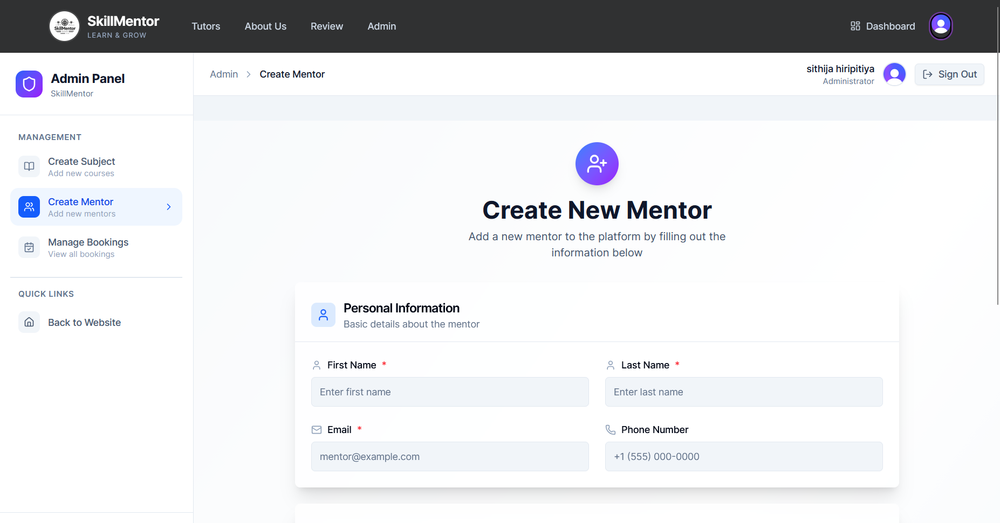
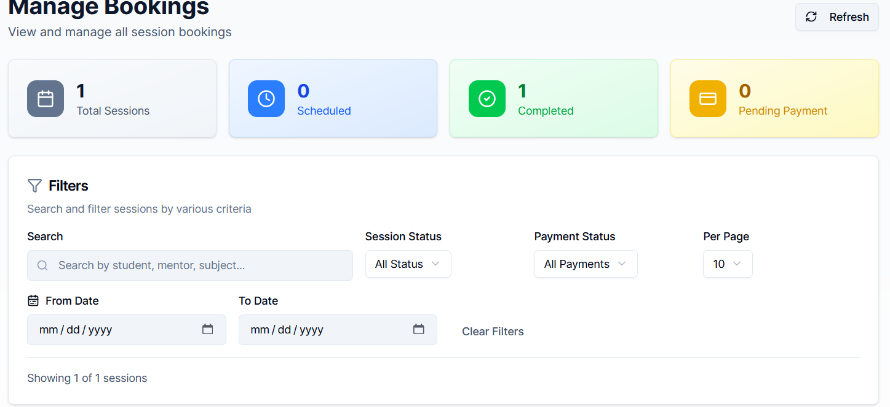
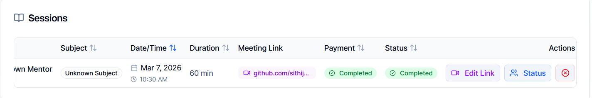
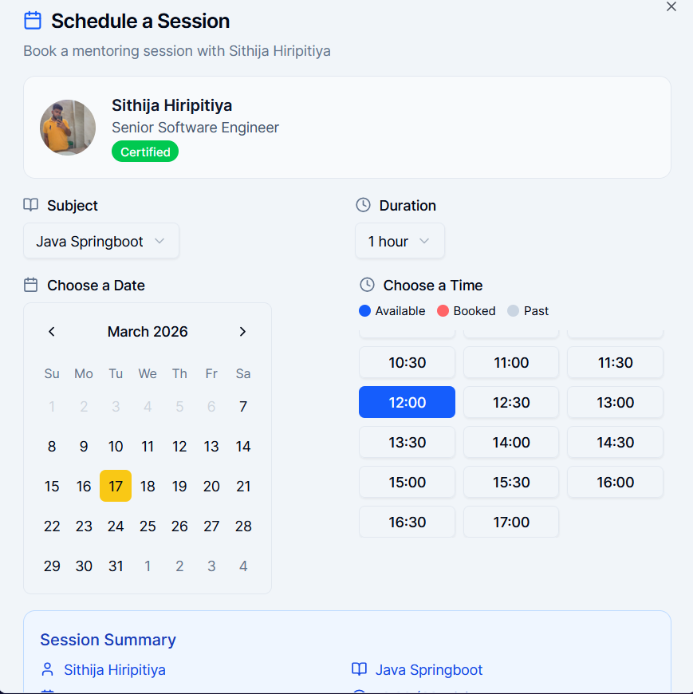
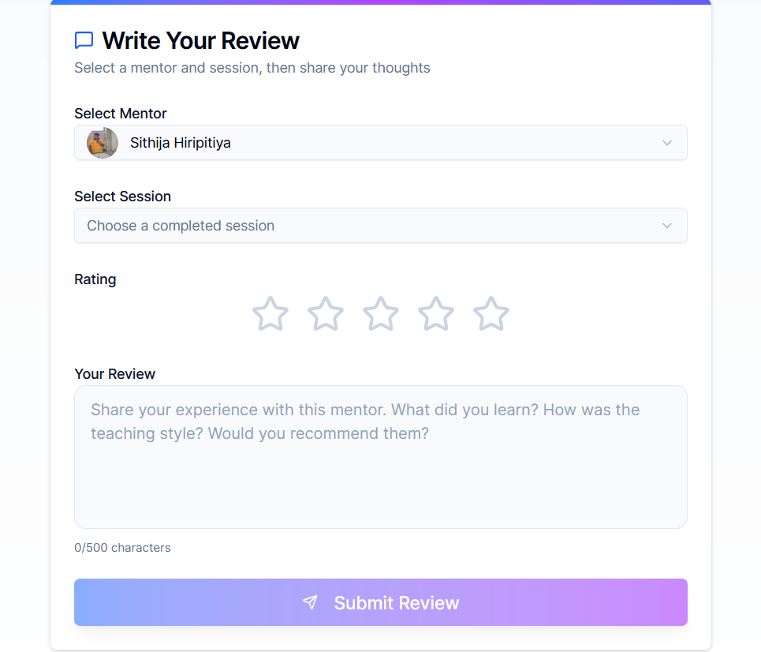

# Skill Mentor 🧑‍🏫


SkillMentor is a **online mentoring platform** that connects students with expert mentors for specialised subjects. Students can browse available mentors, view their expertise and courses, book one-on-one sessions, make payments, and track their learning progress through a personalised dashboard.

This project aims to provide you with exposure to REST API development, connecting entities with relationships, working with sessions, performing state transitions, and basic user workflows


----

# Features

## 1.1 Create mentors 

Admin or another mentor can create mentors by navigating to the "admin" page. Admin page can only display either a registered mentor or an admin.
Please ensure that you are an admin or mentor before creating a new member.

These are the steps to creating mentor 

## Admin page features
### 1.1.1. Navigate to the "Admin" page 

<br/>


### 1.1.2. Select the "Create Mentor" button 
* Under this page, there is a form that you need to provide the mentor's details <br />

<br />


## 1.2 Assign subjects for mentors

Mentors/ admins can assign subjects for mentors.


## 1.3 Manage bookings 

Admins/ mentors can filter sessions/ bookings that have been created on the admin page.



<br />


Furthermore, admin/ mentor can upload or change session links,session/payment states and delete.




## Booking a session 

Users may schedule sessions by choosing a time slot that aligns with the mentor's availability.

Users must select these before booking a session :

* Subject 
* Duration
* Date and time

A detailed summary of the session is available in the following section of the booking page for the user's review.




## Rate your mentor

Users can submit their opinion on the mentors with whom they have completed a learning engagement.



## View Mentor profile

Users can view a mentor's profile page to gain a better understanding of their expertise before making a booking


# Tech Stack 

## Frontend 

* React + TypeScript 
* Vite
* Tailwind CSS
* ShadCn UI

## Backend
* Java spring boot

## Database 
* PostgreSQL 
## Authentication & Authorization 
* Clerk


# File Structure 

## Frontend

```text
skillmentor-frontend/
├── src/
│   ├── assets/
│   │   ├── ReadmeAssest/            # Screenshots for documentation
│   │   │   ├── adminpage-mentor.png
│   │   │   ├── homepage.png
│   │   │   ├── managebookings.png
│   │   │   ├── navigationbar.png
│   │   │   └── sessionfunctions.png
│   │   ├── aws-certified-1.webp
│   │   ├── logo.webp
│   │   ├── mentor-1.webp
│   │   └── microsoft-certified-1.webp
│   ├── components/
│   │   ├── ui/                      # Reusable UI elements
│   │   │   ├── Footer.tsx
│   │   │   ├── Layout.tsx
│   │   │   ├── MentorCard.tsx
│   │   │   ├── Navigation.tsx
│   │   │   ├── ProfilePage.tsx
│   │   │   ├── SchedulingModel.tsx
│   │   │   └── SignUpDialog.tsx
│   │   └── StatusPill.tsx           # Status indicators
│   ├── hooks/                       # Custom React hooks
│   ├── lib/                         # Utility functions and API config
│   │   ├── api.ts
│   │   └── utils.ts
│   ├── pages/
│   │   ├── admin/                   # Admin-specific views
│   │   │   ├── AdminLayout.tsx
│   │   │   ├── CreateMentor.tsx
│   │   │   ├── CreateSubject.tsx
│   │   │   ├── ManageBooking.tsx
│   │   │   └── PaymentManage.tsx
│   │   ├── AboutUs.tsx
│   │   ├── ChessGame.tsx            # Games/Interactive features
│   │   ├── DashboardPage.tsx
│   │   ├── HomePage.tsx
│   │   ├── LoginPage.tsx
│   │   ├── PaymentPage.tsx
│   │   └── ReviewMentorSession.tsx  # Feature for mentor feedback
│   ├── App.tsx                      # Main application component
│   ├── index.css                    # Global styles
│   ├── main.tsx                     # Entry point
│   ├── types.ts                     # TypeScript interfaces
│   └── vite-env.d.ts
├── .env.local                       # Local environment variables
├── .gitignore
├── components.json                  # UI component configuration
├── eslint.config.js
├── index.html
├── package.json
├── README.md                        # Project documentation
├── tsconfig.json                    # TypeScript configuration
└── vite.config.ts                   # Vite build configuration


```

# Deployed Link

Frontend Deployed link - 
<br />

Swagger deployed link - https://skill-mentor-frontend-final.vercel.app/subject-controller/getSubjectById


